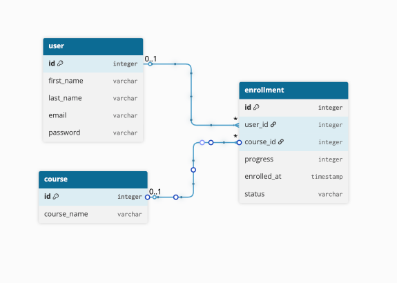

# BudyFi Backend

##  Overview
This is the backend for the **BudyFi** educational finance app, built with **Flask** and **SQLAlchemy**.  
It manages users, courses, and enrollments (progress tracking).

---
## Features

*TBD*

--- 

## Project Structure

*TBD*

--- 

##  Current Data Models
- **User** – represents app users
- **Course** – represents the available courses
- **Enrollment** – connects users and courses, storing progress and status

---

##  Screenshots
Place screenshots in the `assets` folder and reference them here like this:

**App Flow:**

**Entity Relationship Diagramm:**

---

## Requirements

*TDB*

---

## Installation

*TBD*

--- 

## Usage

*TDB*

---

## Tech Stack
- **Python 3**
- **Flask**
- **SQLAlchemy**
- **SQLite (for now)**

---

##  Roadmap Future Features

*TBD*

---