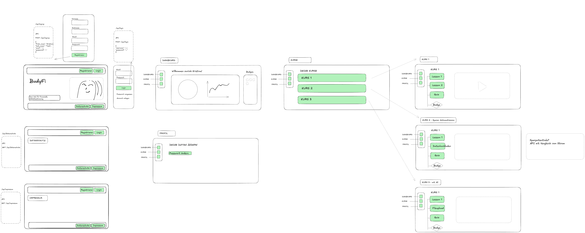

# BudyFi Backend

## 📘 Overview
This is the backend for the **BudyFi** educational finance app, built with **Flask** and **SQLAlchemy**.  
It manages users, courses, and enrollments (progress tracking).

---

## 🧩 Current Data Models
- **User** – represents app users
- **Course** – represents the available courses
- **Enrollment** – connects users and courses, storing progress and status

---

## 🚧 To Do
- [ ] Create Flask routes for User, Course, and Enrollment
- [ ] Entity Relationship (ER) Diagramm for Models
- [ ] 
- [ ] 
- [ ] 

---

## 🖼️ Screenshots
Place screenshots in the `assets` folder and reference them here like this:

```markdown

```

---

## ⚙️ Tech Stack
- **Python 3**
- **Flask**
- **SQLAlchemy**
- **SQLite (for now)**

---

## 💡 Notes
This project is under active development as part of a learning journey.  
Future iterations will include lessons, progress tracking, and badges similar to Duolingo.
