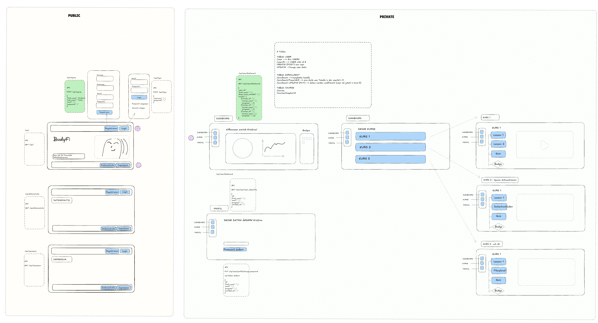

# BudyFi Backend

## Overview
This is the backend for **Buddy.Fi**, a microlearning finance app built with **Flask** and **SQLAlchemy**.  
It manages user registration, login, course data, and individual lesson progress.

---

## Features

- User registration and login with JWT token authentication
- Get current user session data
- View all available courses
- Track progress for individual lessons (per user)
- Store completed lessons
- Secure API endpoints via token-based auth

---

##  Project Structure

```
budifi-backend/
│
├── app.py                         # Main Flask application (entry point)
├── data_manager.py                # Central data access logic
├── extentions.py                  # Flask extensions (DB, bcrypt initialization)
├── requirements.txt               # Python dependencies
├── .env                           # Environment variables (JWT secret, DB path)
├── .gitignore
├── README.md
│
├── assets/                        # Diagrams & documentation screenshots
│
├── data/
│   ├── budifi.db                  # Local SQLite database
│   └── db_exports/                # CSV exports of database tables for deployment imports
│
├── mockdata/                      # Seed and mock data utilities
│   ├── __init__.py
│   ├── course.mock.json
│   └── data_import.py
│
├── models/                        # SQLAlchemy ORM models
│   ├── __init__.py
│   ├── user.py
│   ├── course.py
│   ├── lesson.py
│   ├── lesson_progress.py
│   ├── quiz.py
│   └── question.py
│
└── service/
    └── data_manager/              # Business logic layer
        ├── __init__.py
        └── course_data_manager.py
```

---

##  Data Models

- `User` – represents users of the app
- `Course` – available microlearning courses
- `Lesson` – individual lessons per course
- `Quiz` – each lesson has one quiz (1:1); designed to support multiple questions in the future
- `Question` – currently planned for scalability; not yet fully implemented
- `LessonProgress` – relationship table that stores completion per user and lesson

---

##  Endpoints

| Endpoint | Method | Description                         |
|---------|--------|-------------------------------------|
| `/api/health` | GET | Check backend status                |
| `/api/register` | POST | Register new user                   |
| `/api/login` | POST | Login, returns JWT token            |
| `/api/me` | GET | Get current user session from token |
| `/api/courses` | GET | Get all courses data                |
| `/api/user/<int:user_id>/progress` | GET | Get progress for a user             |
| `/api/user/<int:user_id>/progress` | PUT | Update lesson progress for a user   |

---

## Authentication & Security

⚠️ Currently, all endpoints are public. Although a `@token_required` decorator is defined in the codebase, it is not yet applied to any routes. Therefore, routes like `/api/me`, `/api/courses`, and `/api/user/<int:user_id>/progress` are accessible without authentication.

This setup is temporary and will be updated in a future version to secure all sensitive routes using JWT-based authentication.

Once protection is implemented, users will authenticate as follows:

1. Send a POST request to `/api/login` with valid credentials.
2. The response will include a JWT token.
3. Include this token in the `Authorization` header when making requests:

```http
Authorization: Bearer <your_token_here>
```

---

##  Usage (Local)

1. Clone the repo  
2. Create a virtual environment  
3. Run:  
```bash
pip install -r requirements.txt
```

4. Add a `.env` file in the root folder:
```dotenv
SECRET_KEY=your-secret-key-for-JWT-signature-validation
DATABASE_URL=sqlite:///data/budifi.db
```

5. Start the app:
```bash
python3 app.py
```

---

## Usage (Deployed)

A deployed version of the Buddy.Fi frontend is available here:  
[https://buddyfi-2.vercel.app/](https://buddyfi-2.vercel.app/)

⚠️ Note: The deployed version is currently under development. For the MVP demo setup, the frontend is deployed on Vercel while the backend runs locally on your machine.

- Make sure your backend is running locally via `python3 app.py`
- Then open the deployed frontend URL in your browser to test the connection
- This setup simulates how the final app might interact with a hosted backend in the future

---

##  Screenshots

**Wireframes:**



**App Flow (Routing):**


**Entity Relationship Diagram:**  


---

## Tech Stack

- Python 3  
- Flask  
- SQLAlchemy  
- SQLite (for development)  
- JWT for authentication  
- dotenv for secrets  

---

##  Roadmap

Coming next:

- Improved design and visual polish
- Add fun & motivational dashboard (progress tracking, badges)
- Introduce AI feature (TBD)
- Payment integration (for subscription or donation model)

---

##  Notes

- Backend works without the frontend – you can test API endpoints via tools like Postman or curl.
- Data is stored in a local SQLite database (can be migrated later).


_______________
---