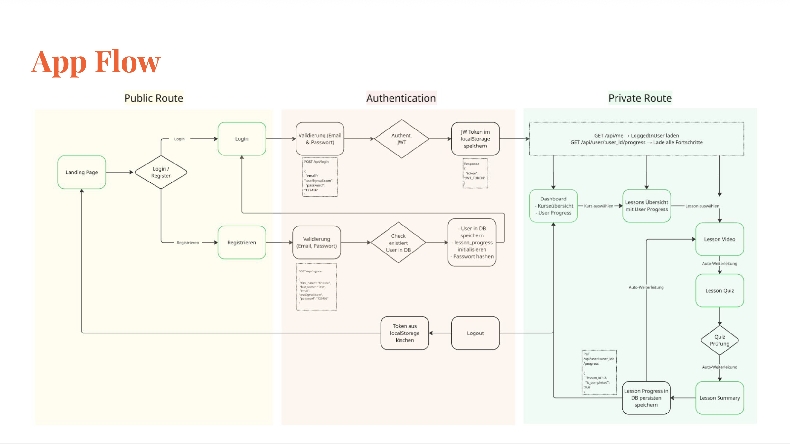
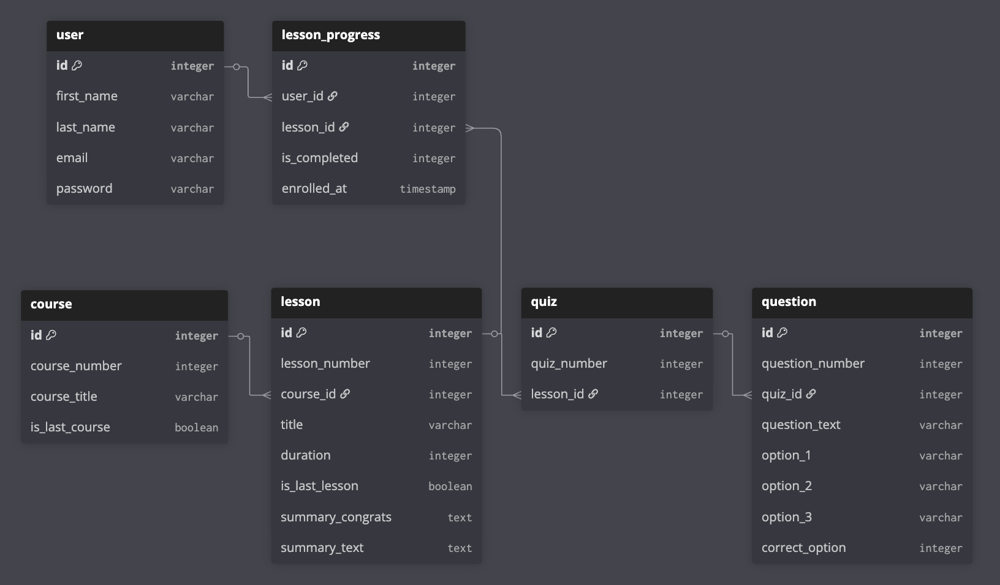

# Buddy.Fi Backend

Flask-based REST API powering the Buddy.Fi learning platform.

The backend handles JWT authentication, course management, lesson progression, user-specific progress tracking, and relational data persistence using SQLAlchemy ORM across SQLite (local development) and PostgreSQL/Supabase (cloud deployment).

---

## Architecture Overview



The backend powers authentication, course management, lesson progression, and user-specific learning progress through a RESTful API architecture.

---

## Data Model



The application uses a relational database design built with SQLAlchemy ORM.

Core entities include:

- User
- Course
- Lesson
- Quiz
- Question
- LessonProgress

This structure enables scalable course management and persistent progress tracking.

### Key Relationships

- LessonProgress stores lesson completion state per user
- Quiz is linked 1:1 to a Lesson
- Question is prepared for future quiz expansion

---

## Features

- User registration and login with JWT authentication
- Protected API routes using a custom JWT decorator
- User session retrieval via token validation
- Dynamic course retrieval from the database
- User-specific lesson progress tracking
- Persistent learning progress storage
- RESTful API architecture

---

## Endpoints

| Endpoint | Method | Description |
|----------|---------|-------------|
| /api/health | GET | Check backend status |
| /api/register | POST | Register new user |
| /api/login | POST | Login and receive JWT token |
| /api/me | GET | Get current authenticated user |
| /api/courses | GET | Retrieve all courses |
| /api/user/<int:user_id>/progress | GET | Get lesson progress |
| /api/user/<int:user_id>/progress | PUT | Update lesson progress |

---

## Authentication & Security

JWT-based authentication is implemented for protected application routes.

Protected endpoints include:

- `GET /api/me`
- `GET /api/courses`
- `GET /api/user/<int:user_id>/progress`
- `PUT /api/user/<int:user_id>/progress`

Authentication is enforced through JWT validation before granting access to protected resources.

### Authentication Flow

1. User logs in via `POST /api/login`
2. Backend returns a JWT token
3. Client sends the token in the `Authorization` header
4. Protected routes validate the token before processing requests

Example:

```http
Authorization: Bearer <your_token_here>
```

---

## Deployment

### Frontend

https://buddyfi-2.vercel.app/

### Backend API

https://buddyfi-backend.onrender.com/

### Money Compass API

https://money-compass-api.onrender.com/

The Buddy.Fi ecosystem is deployed across multiple services:

- Frontend hosted on Vercel
- Backend REST API hosted on Render
- Money Compass AI service hosted on Render
- PostgreSQL database hosted on Supabase
- Learning videos hosted in Firebase Storage

This architecture separates frontend, backend, AI services, database, and media storage into independent, scalable services.

---

## Local Development

Install dependencies:

```bash
pip install -r requirements.txt
```

Create a `.env` file:

```dotenv
SECRET_KEY=your-secret-key
DATABASE_URL=sqlite:///data/budifi.db
```

Start the server:

```bash
python3 app.py
```

The API will be available at:

```text
http://localhost:5003
```

---

## Project Structure

```text
budifi-backend/
│
├── app.py
├── data_manager.py
├── extentions.py
├── requirements.txt
├── .env
│
├── data/
│   ├── budifi.db
│   └── db_exports/
│
├── mockdata/
│   ├── course.mock.json
│   └── data_import.py
│
├── models/
│   ├── user.py
│   ├── course.py
│   ├── lesson.py
│   ├── lesson_progress.py
│   ├── quiz.py
│   └── question.py
```

---

## Tech Stack

- Python 3
- Flask
- SQLAlchemy
- SQLite (local development)
- PostgreSQL / Supabase (cloud deployment)
- JWT Authentication
- Flask-CORS
- bcrypt
- dotenv

---

## Roadmap

Coming next:

- Admin dashboard integration
- Payment API integration
